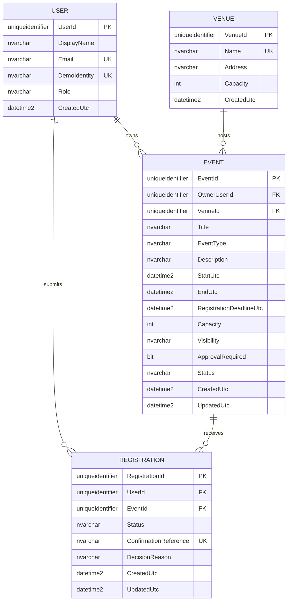

# EventFlow database ERD

Phase 1 defines four database entities:

## Relationship and integrity rules

- One organizer user owns zero or more events.
- One venue hosts zero or more events.
- One user submits zero or more registrations.
- One event receives zero or more registrations.
- `(UserId, EventId)` is unique, so a user has one historical registration row per event.
- `ConfirmationReference` is unique only when populated; multiple Pending or
  Cancelled rows may correctly have no reference.
- Registration rows are never cascaded away by user or event deletion.
- `Pending` and `Confirmed` registrations reserve capacity.
- `Cancelled` registrations do not reserve capacity.
- `Confirmed` registrations require a confirmation reference.
- `Event.Capacity` must be positive and is additionally checked against venue capacity by the application.
- Schedule overlap and atomic capacity reservation are application transaction rules.

## Controlled values

| Column | Allowed values |
|---|---|
| `User.Role` | `Attendee`, `Organizer` |
| `Event.Visibility` | `Public`, `Unlisted` |
| `Event.Status` | `Active`, `Closed`, `Postponed`, `Cancelled` |
| `Registration.Status` | `Pending`, `Confirmed`, `Cancelled` |

All timestamps are stored as UTC `datetime2(0)` values. The SQL script uses
`SYSUTCDATETIME()` for defaults.
